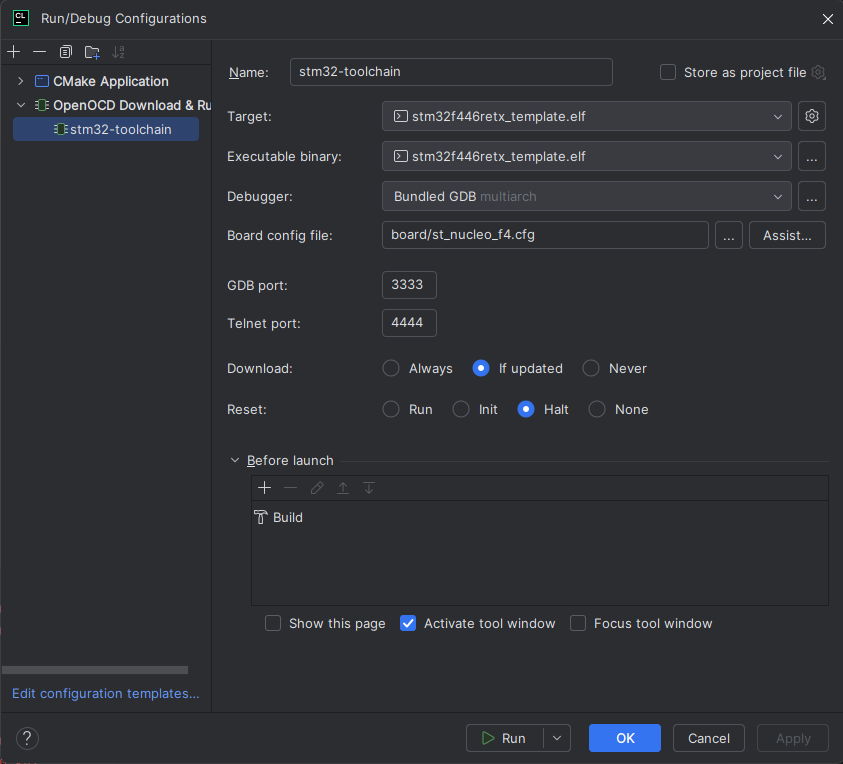
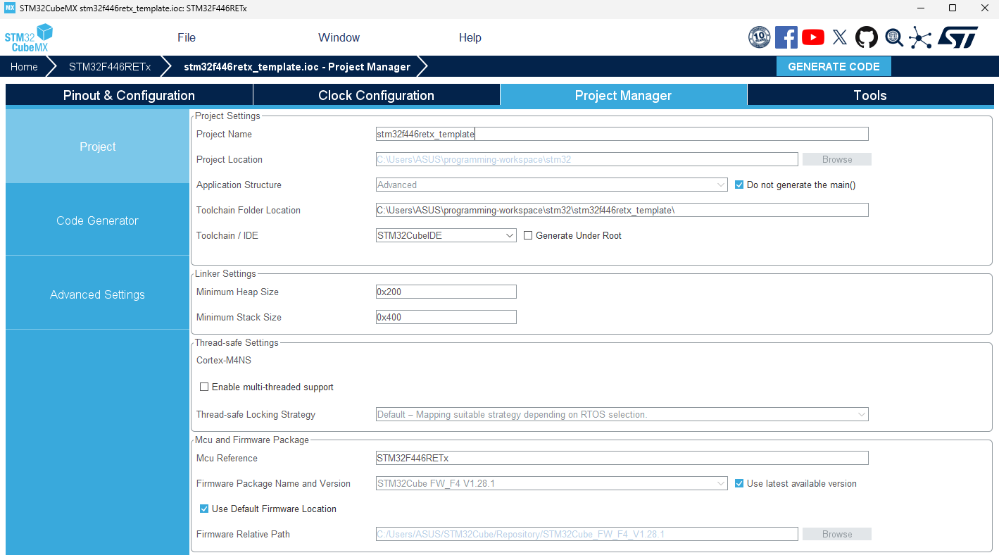

# BME Suborbitals | AtheNAVI Software

## Project Structure
The mandatory project structure is already set up in this repository.
The Core folder contains the startup file. The startup file is responsible for setting up the microcontroller.
In the Drivers folder, you can find the STM32Cube HAL library. The Inc folder contains the header files, and the Src folder contains the source files. The project is set up to use the STM32Cube HAL library, and the STM32CubeMX tool was used to generate the initialization code.
In the STM32CubeIDE folder you can find the project file for the STM32CubeIDE. 

The app folder contains the main.cpp file, which is the entry point of the application. All user created code must be placed in this folder.

## General Prerequisites
- STM32CubeCLT https://www.st.com/en/development-tools/stm32cubeclt.html#get-software
- STM32CubeMX https://www.st.com/en/development-tools/stm32cubemx.html#st-get-software
- STM32Cube MCU Package for STM32F4 series https://www.st.com/en/embedded-software/stm32cubef4.html

## Usage
To use this repository as a template, click on the "Use this template" button on the top of the page. After the repository is created, clone it to your local machine. The project can be built and flashed to the microcontroller using Visual Studio Code, CLion or STM32CubeIDE.

### CLion
1. Open project.
2. Edit Run/Debug configuration:
   	- Set the target to `stm32f446retx_template.elf`
	- Set the executable to `stm32f446retx_template.elf`
    - Set board config file to: `board/st_nucleo_f4.cfg`
    - Set reset to `Halt`

2. Tudja.

### Visual Studio Code

#### Required Extensions
- C/C++: https://marketplace.visualstudio.com/items?itemName=ms-vscode.cpptools
- CMake Tools: https://marketplace.visualstudio.com/items?itemName=ms-vscode.cmake-tools
- Cortex-Debug: https://marketplace.visualstudio.com/items?itemName=marus25.cortex-debug

#### Configuration

1. Create build task. This can be done by selecting *Tasks: Configure Task* and then *CMake: build* from the Command Palette or editing `.vscode/tasks.json`.
	```json
	{
		"version": "2.0.0",
		"tasks": [
			{
				"type": "cmake",
				"label": "CMake: build",
				"command": "build",
				"targets": [
					"all"
				],
				"group": "build",
				"problemMatcher": [],
				"detail": "CMake build task"
			}
		]
	}
	```
2. Create launch confiugration. Edit `.vscode/launch.json`, there is a template for Cortex-Debug with ST-Link. Change the executable to reflect the CMake build location. Set the `preLaunchTask` to `CMake: build` or what it's named in `tasks.json`
	```json
	{
		"version": "0.2.0",
		"configurations": [
			{
				"name": "Cortex Debug",
				"cwd": "${workspaceFolder}",
				"executable": "${command:cmake.launchTargetPath}",
				"request": "launch",
				"type": "cortex-debug",
				"runToEntryPoint": "main",
				"servertype": "stlink",
				"preLaunchTask": "CMake: build"
			}
		]
	}
	```
3. You may need to add `"C_Cpp.default.configurationProvider": "ms-vscode.cmake-tools"` to `.vscode/settings.json` for the linter to work correctly.

### Modify Configuration
The STM32CubeMX tool generates the initialization code for the microcontroller. The configuration can be modified by opening the `.ioc` file in STM32CubeMX. After the configuration is modified, the code must be generated again.

> **IMPORTANT NOTICE:** 
> After the first code generation uncheck the "Generate Under Root" option in STM32CubeMX. This will prevent the CubeMX from overwriting the CMakeLists.txt file.

### Modify Project Name
Note that all project using this repository must be renamed. Modify the following files:
1. Rename stm32f446retx_template.ioc to the new subsystem name.
2. In CMakeLists.txt change the project name to the desired subsystem name.

	```cmake
 	# project settings
		project(<subsystem name to be changed> C CXX ASM)
		set(CMAKE_CXX_STANDARD 17)
		set(CMAKE_C_STANDARD 11)
	```

3. Modify the content of .ioc file to reflect the new project name.
	```
		ProjectManager.ProjectFileName=<subsystem name to be changed>.ioc
		ProjectManager.ProjectName=<subsystem name to be changed>
	```

## Creation of the Template
Note: You do not need to do this if you are using this repository as a template. Although, if you want to create a similar template, you can follow the steps below.
1. Create a new project in STM32CubeMX by selecting the chosen microcontroller.
2. Configure the project settings on the Project Manager tab. Set required project name and location. On the same tab set the toolchain/IDE to STM32CubeIDE and make sure to tick "Generate under Root" option. Also, tick the "Do not generate the main" checkbox.

4. According to your needs configure the peripherals on the Pinout & Configuration tab, and set clock configuration on the Clock Configuration tab.
4. Generate the code by clicking on the "Generate code" button.
5. After the code is generated it can be opened as a project in both VSCode, Clion and STM32CubeIDE. To do so, open the folder create the main.cpp with a main entry point. Afterwards, the newly created source files must be added to the CMakeLists.txt as follows:
	```cmake
 	add_executable(${PROJECT_NAME}.elf ${SOURCES} ${LINKER_SCRIPT} app/src/main.cpp)
	```
6. The project can be built and flashed to the microcontroller using the selected IDE.


